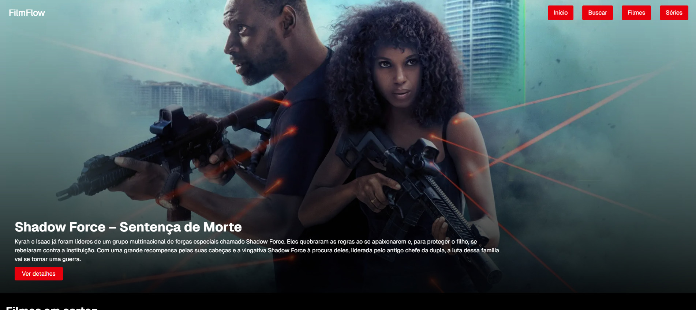

# 🎬 FilmFlow

 

---

## 📌 Descrição do Projeto

O **FilmFlow** é uma aplicação web de catálogo de filmes, desenvolvida como parte do meu portfólio como Desenvolvedor Front-end Júnior.

O objetivo do projeto é demonstrar minhas habilidades em **Next.js**, **React.js**, **Tailwind CSS**, consumo de **APIs REST** e construção de **interfaces responsivas e modernas**, com integração direta à **API TMDB**.

---

## 🛠️ Tecnologias Utilizadas

- Next.js (App Router)
- React.js
- Tailwind CSS
- API TMDB
- Framer Motion
- JavaScript (ES6+)

---

## 🚀 Funcionalidades

- ✅ Listagem de filmes por categorias (Populares, Top Rated, etc)
- ✅ Página de detalhes de cada filme com informações completas
- ✅ Filtros por gênero
- ✅ Sistema de busca por título de filme
- ✅ Rotas dinâmicas com Next.js
- ✅ Consumo de API externa (TMDB)
- ✅ Design responsivo (Mobile First)
- ✅ Animações com Framer Motion
- ✅ SEO básico com Next.js

---

## 📷 Demonstração

👉 Deploy do projeto:  
🔗 [https://filmflow-nu.vercel.app/](https://filmflow-nu.vercel.app/)

---

## 💻 Como Rodar o Projeto Localmente

### 1. Clone o repositório:

```bash
git clone https://github.com/lcfranco97/filmflow.git
```

### 2. Acesse a pasta do projeto:
```bash
cd filmflow
```

### 3. Instale as dependências:
```bash
npm install
```

### 4. Configure a API da TMDB:
- Crie um arquivo chamado .env.local na raiz do projeto.
- Adicione a seguinte variável (coloque sua chave da API TMDB):
```bash
NEXT_PUBLIC_API_KEY=SUA_API_KEY_AQUI
```
### 5. Rode o servidor:
```bash
npm run dev
```

### 6. Acesse no navegador:
```bash
http://localhost:3000
```

---

## 💡 Aprendizados com o Projeto
Durante o desenvolvimento do FilmFlow, pratiquei:

- Consumo de APIs REST

- Rotas dinâmicas com Next.js

- Gerenciamento de estado e parâmetros de URL

- Responsividade com Tailwind CSS

- SEO básico com Next.js

- Animações com Framer Motion

---

## 📞 Contato

- LinkedIn: [https://www.linkedin.com/in/lucas-franco-39579b208/](https://www.linkedin.com/in/lucas-franco-39579b208/)
- GitHub: [https://github.com/lcfranco97](https://github.com/lcfranco97)
- Portfólio: [https://portfolio-lc.vercel.app/](https://portfolio-lc.vercel.app/)

